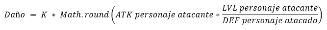

# Aventuras de Marcos y Luis
_Estudiante: Andrea Palma_  
_Curso: CC3002_  

Actualizado el día 08-11-2021 (Tarea 2)

## Generalidades
El código base creado se encuentra en el package
[main-aventurasdemarcoyluis](src/main/java/com/aventurasdemarcoyluis),
mientras que los test relacionados a este se encuentran en 
[test-aventurasdemarcoyluis](src/test/java/com/aventurasdemarcoyluis)  
- [MODEL_main](src/main/java/com/aventurasdemarcoyluis/model): Aquí se encuentra el esqueleto del modelo,
en donde se programaron
todas las clases, métodos, interfaces, etc. Se divide en:  

  - [MODEL_abstract_classes](src/main/java/com/aventurasdemarcoyluis/model/abstract_classes):
  En este package se encuentran todas las clases abstractas creadas.
Las cuales referencian a cada modelo: **Item** _(AbstractItem)_, **Entidad** _(AbstractEntities)_,
  **Enemigo** _(AbstractEnemy)_, **Player** _(AbstractPlayer)_, **Tipo de Ataque** _(AbstractAttackType)_.  
  - [MODEL_interfaces](src/main/java/com/aventurasdemarcoyluis/model/interfaces):
  En este package se encuentran todas las interfaces ocupadas.  
  - [MODEL_players](src/main/java/com/aventurasdemarcoyluis/model/players):
  En este package se encuentra los modelos de Jugadores. Los cuales son **Marco** y **Luis**.  
  - [MODEL_enemies](src/main/java/com/aventurasdemarcoyluis/model/enemies):
  En este package se encuentran los modelos de Enemigos. Los cuales son **Boo**, **Goomba** y **Spiny**.  
  - [MODEL_items](src/main/java/com/aventurasdemarcoyluis/model/items):
  En este package se encuentran los modelos de Item: **Honey Syrup**, **Red Mushroom** y **Star**.  
  - [MODEL_attacks](src/main/java/com/aventurasdemarcoyluis/model/attacks):
  En este packege se encuentran los modelos de Ataque: **Martillo** _(HammerAttack)_ y **Salto** _(JumpAttack)_. 

- [CONTROLLER_main](src/main/java/com/aventurasdemarcoyluis/controller): Aquí se encuentra el controlador que
implementa las reglas y el flujo del juego. Posee además una clase 
[GAME_EXAMPLE](src/main/java/com/aventurasdemarcoyluis/controller/GameExample.java) con la cual se puede jugar. 
- [TEST_main](src/test/java/com/aventurasdemarcoyluis): Aquí se encuentran todos los test realizados
sobre el modelo y el controlador. 
Dentro del paquete "controller" se testea el controlador. Se puede observar una situación
ganadora y una perdedora. También se emplea el uso de items.  
Dentro del paquete "model" se testean las clases abstractas que darán vida a los modelos mencionados anteriormente
y, las clases de los enemigos y jugadores.  
  - [TEST_MODEL_abstract_classes](src/test/java/com/aventurasdemarcoyluis/model/abstract_classes):
Se testean todos los métodos de las clases abstractas los cuales serán ocupados por cada modelo de item,
ataque, jugador o enemigo. Y las diferencias entre cada modelo.  
  - [TEST_MODEL_players](src/test/java/com/aventurasdemarcoyluis/model/players):
Aquí se testea la interacción de los players con cada item (e inventario), los ataques sobre los enemigos y la correcta
funcionalidad de las características que poseen los players.   
  - [TEST_MODEL_enemies](src/test/java/com/aventurasdemarcoyluis/model/enemies):
Aquí se testean los ataques de los enemigos hacia los players.  

## Intrucciones
Puede acceder a cada lugar del código haciendo click en las anteriores referencias. Por ejemplo,
si quiere observar el código del modelo Luis, debe hacer click en **[MODEL_players]** de la sección anterior,
el cual le llevará al package que contiene el modelo Luis.  

Se recomienda ejecutar los test uno por uno, dirigiéndose al package donde
se encuentra el test, haciendo click encima del nombre y luego otro click en **[Run 'Test' in...]**. 

Si se requiere revisar el coverage de los test del código, diríjase a la carpeta **[test]**, haga click derecho sobre ella,
busque **[More Run/Debug]** y haga click en **[Run 'Test' With Coverage]**.

El archivo ejecutable de ejemplo se encuentra en 
[GAME_EXAMPLE](src/main/java/com/aventurasdemarcoyluis/controller/GameExample.java). Si se quiere revisar 
un enfrentamiento entre las entidades jugador v/s enemigos, usando items y todo, se recomienda ejecutar. 

## Supuestos
Siguiendo la tabla de ataques descrita en la sección 1.1.5 del
[Enunciado](https://www.u-cursos.cl/ingenieria/2021/2/CC3002/1/tareas/r/2021091617049EBCB4003D150FF0__Enunciado_Tarea_01.pdf)
se hacen los siguientes supuestos de ataque:
- Luis **NO** puede atacar a Boo. (No hay métodos que lo permitan)
- Boo **NO** puede atacar a Marco. (No hay métodos que lo permitan)
- Marco puede atacar a **TODOS** los enemigos.
- Spiny y Goomba pueden atacar a **TODOS** los jugadores.

Además se considera que:

- Los enemigos no pueden usar objetos.
- Inicialmente el inventario de los jugadores está vacío.
- Un jugador no puede ocupar un item que no esté en su inventario.
- Un jugador no puede tener cantidades negativas de un item en su inventario.
- Al usar un item, este se consume y se reduce la cantidad en el inventario.
- Si un jugador tiene su vida en máximo y usa Red Mushroom, no pasa nada.
- Si un jugador tiene sus puntos de ataque en máximo y usa Honey Syrup, no pasa nada.
- Los enemigos no tienen **Puntos de Ataque (FP)** (estos son igual a 0), es decir,
ellos saben que pueden atacar siempre y cuando no estén muertos.
- Ninguna de las estadísticas de las entidades (enemigos y players) es negativa.
    - En definitiva, los métodos para la **Vida (HP)** y los **Puntos de Ataque (FP)**
  no permiten que estos sean menores a 0 ni mayores que el máximo (**maxHP** y **maxFP**).
- Boo, Goomba y Spiny tienen las mismas probabilidades de aparición.
- Los enemigos eligen aleatoriamente a qué jugador atacar.
- Los jugadores eligen personalmente a qué enemigo atacar y con qué ataque.
- Cada clase sabe sus restricciones, por ejemplo, **Luis** sabe que no puede atacar a **Boo**
  (y no lo intenta) y **Boo** sabe que no puede atacar a **Marco** (y no lo intenta) 
[esto se explicará mejor después].

Para simular de mejor manera las peleas:

- Con el PrintStream adecuado se añadieron mensajes que printean las interacciones de items y pelea 
entre los jugadores y enemigos dentro del 
[GAME_EXAMPLE](src/main/java/com/aventurasdemarcoyluis/controller/GameExample.java). Por ejemplo, al atacar a Spiny con un Salto se lanzará un mensaje que dirá "Spiny se 
protege con sus pinchos!".

El ataque es calculado con la fórmula de la sección 1.1.3 del
[Enunciado](https://www.u-cursos.cl/ingenieria/2021/2/CC3002/1/tareas/r/2021091617049EBCB4003D150FF0__Enunciado_Tarea_01.pdf)
pero con una modificación de redondeo, pues para limpiar código, la parte del
cálculo con el ATK del personaje atacante con su LVL y la DEF del personaje atacado, 
se condensa en el método ***preDamage*** (en _AbstractEntities_):

 

Además, el resultado final también se redondea y se transforma a entero.

## Funcionamiento y Lógica del Programa
Tomando en cuenta los supuestos mencionados en la sección anterior. Se realizarán
algunos ejemplos de las funcionalidades de algunos métodos.

Tenemos a Marco y Luis como jugadores derivados de la clase abstracta _AbstractPlayer_,
y a Goomba, Boo y Spiny como enemigos derivados de la clase abstracta _AbstractEnemy_.

La Batalla comienza con un Marco y Luis predeterminado:  
> Marco | nivel: 17, ataque: 15, defensa: 17, vida: 69, fp: 8  
> Luis | nivel: 15, ataque: 17, defensa: 14, vida: 72, fp: 10

Y en el baúl de objetos se encuentran 3 Honey Syrup y 3 Red Mushroom.

A lo largo de la batalla Marco y Luis pueden elegir diferentes opciones. Éstas se explican dentro de la
misma batalla. Las opciones son:

> Al Momento de elegir qué hacer la persona que juega pueden escribir:  
> 0 : Si quiere que los jugadores ataquen en el turno respectivo de cada uno.  
> 1 : Si quieren elegir un objeto del baúl  
> 2 : Si quieren pasar el turno  
> (Esto se visualiza en los métodos playerElection y electionTurn)
> 
> Si está en modo ataque se puede elegir al enemigo al cual atacar según el número impreso
> en pantalla, es decir, si inicialmente se tienen 3 enemigos, estos se mostrarán en pantalla
> con un número. El jugador es libre de elegir qué enemigo atacar escribiendo el número.
> (Esto se visualiza en el método electionAttack)
> 
> Si está en modo elección de objeto, estos también se mostrarán con un número:  
> 1 : Si se quiere utilizar Honey Syrup  
> 2 : Si se quiere utilizar Red Mushroom  
> (Esto se visualiza en el método electionUseItem)

## Anotaciones
- El modo de juego no es definitivo, es solo para esta tarea.
- Tuve que usar casteos pues no se me ocurrió otra manera de generar mi código.
- Creé varias funciones para evitar usar "is instance of" como isPlayer() o isBoo(). Pero la gran
mayoría de estas funciones solo las hice para que quedara bonito el juego. 
- Que tengas buena tarde.

